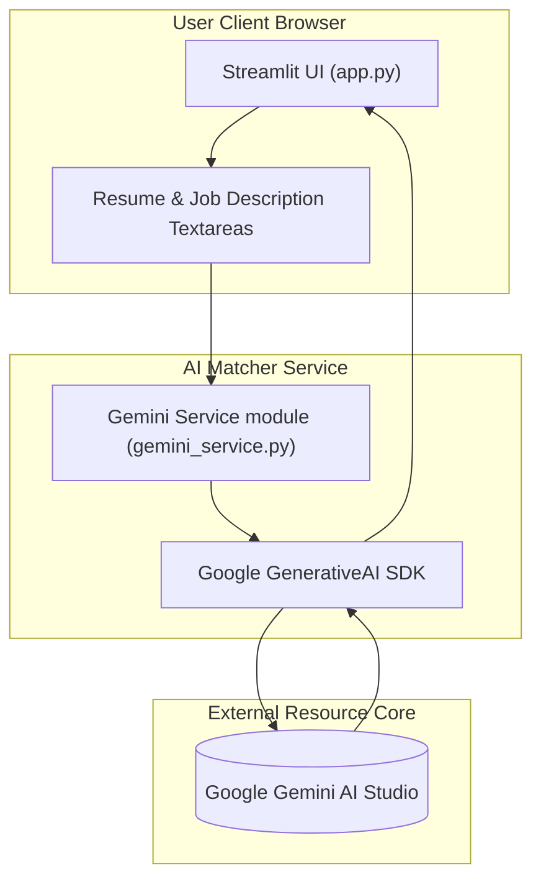

# Hermes Job Matcher (AI Resume & Job Match Analyzer)

A production-grade, AI-augmented resume tailoring and applicant tracking system (ATS) optimization engine built on top of Python, Streamlit, and Google Gemini. Features intelligent keyword gap analysis, structural match scoring, and automated resume bullet point transformation.

## Features

- **ATS Alignment Score**: Instantly calculates compatibility percentage (0–100%) against job descriptions.
- **Technical Keyword Extraction**: Performs conceptual gap analysis between resumes and JDs to extract missing tools, frameworks, and methodologies.
- **Tailored Bullet Upgrade Engine**: Generates 3–5 high-impact, results-driven resume bullet points matching the targeted job's syntax and scope.
- **ATS Impact Explanations**: Details the recruitment rationale and keyword integration value behind each recommended rewrite.
- **One-Click Reports**: Download full compatibility analysis as a text report locally.
- **Premium Glassmorphic Interface**: Dark space-themed UI crafted with customized Streamlit overrides and layout grids.

---

## Tech Stack

- **Frontend/UI**: Streamlit (Python-native web dashboard framework).
- **LLM/AI Model**: Google Gemini API (`gemini-2.5-flash`) utilizing structured JSON generation.
- **Environment**: Python 3.10+ and `python-dotenv`.

---

## Folder Structure

```
ai-resume-job-match-analyzer/
├── app.py                 # Streamlit UI application dashboard
├── gemini_service.py      # Google Gemini client integration service
├── requirements.txt       # Project python dependencies list
├── .env                   # Environment secrets config (Git ignored)
├── .gitignore             # Git exclusion rules file
└── README.md              # Project setup and user guide documentation
```

---

## System Architecture



---

## Setup Instructions

### Prerequisites
Ensure Python 3.10+ is installed on your local computer system.

### Local Installation

1. Navigate to the project directory:
   ```bash
   cd "AI Resume & Job Match Analyzer"
   ```
2. Set up a local Python virtual environment:
   ```bash
   python -m venv venv
   ```
3. Activate the virtual environment:
   * **Windows (PowerShell)**:
     ```powershell
     .\venv\Scripts\Activate.ps1
     ```
   * **Windows (CMD)**:
     ```cmd
     .\venv\Scripts\activate.bat
     ```
   * **macOS/Linux**:
     ```bash
     source venv/bin/activate
     ```
4. Install all python dependencies:
   ```bash
   pip install -r requirements.txt
   ```
5. Configure the environment variables by creating `.env` in the root:
   ```
   GEMINI_API_KEY=your_gemini_api_key_here
   ```
6. Launch the Streamlit application server:
   ```bash
   streamlit run app.py
   ```

The application will launch on your local host at **[http://localhost:8501](http://localhost:8501)**.
